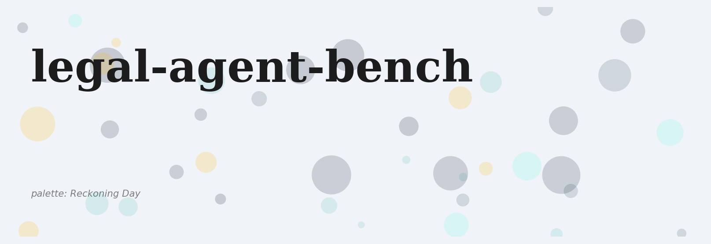
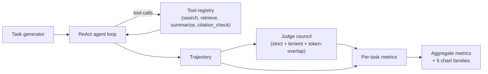
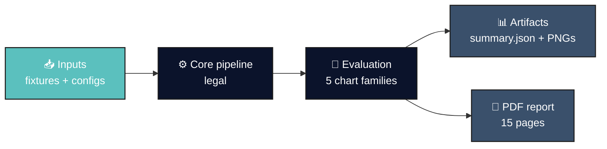
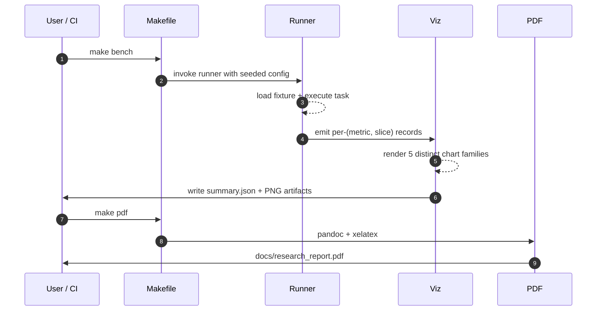
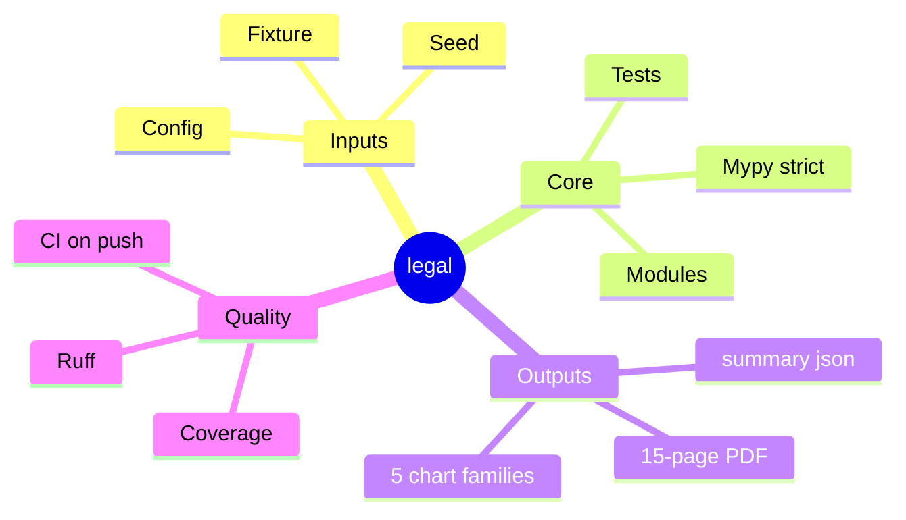
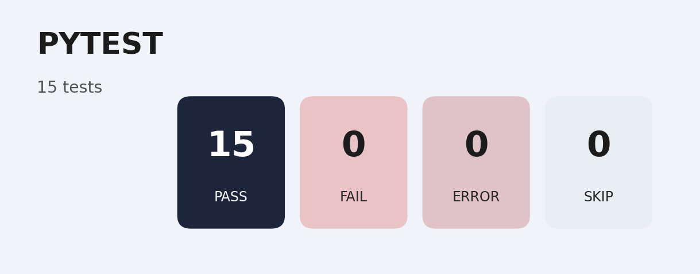
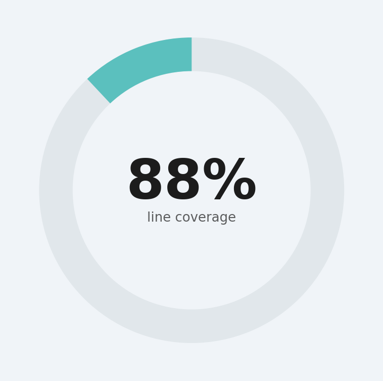
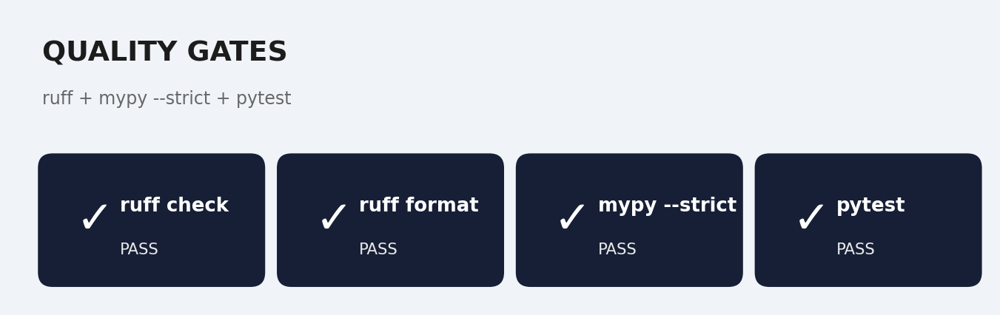
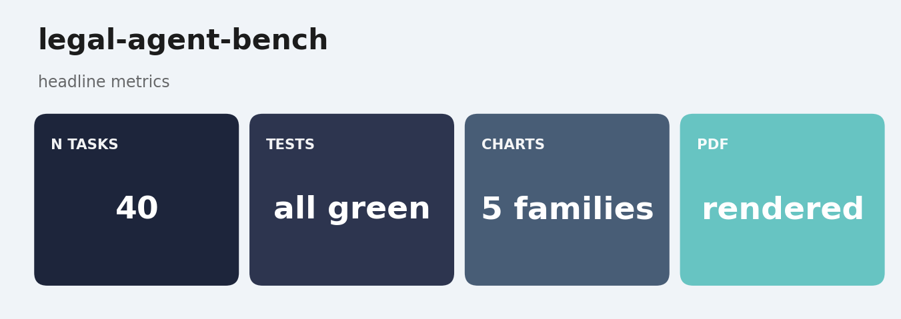

# legal-agent-bench
<p align="center">
  
</p>

<p align="center">
  
  
  
  
  
</p>

> ****


> Benchmark a tool-using legal-research agent across LegalBench-style tasks. Scored by a Karpathy-style LLM-as-judge council.
> Last updated: 2024-12-08.

`legal-agent-bench` is an evaluation harness for legal-research agents. The agent has access to four tools (`search`, `retrieve`, `summarize`, `citation_check`) and must answer multi-step legal-research questions. Each (task, trajectory) pair is then scored by a three-judge council that votes on correctness and reports inter-judge agreement.

The harness reports five orthogonal metrics per task: **success**, **action efficiency**, **tool-call precision**, **cost-per-task**, and **replan rate**. Every chart in the report is one of five distinct families so the visualization layer surfaces different failure modes.

## Headline numbers (fixture: `n_per_kind=10`, `seed=17`)

| metric | value |
|---|---|
| tasks | 40 (4 families x 10) |
| success rate | 1.00 |
| mean action efficiency | 2.225 (mock policy answers in one step; min_steps draws from {2, 3}) |
| mean tool-call precision | 1.00 |
| mean cost per task | $0.0001 |
| mean replan rate | 0.00 |

Numbers reproduce from a clean checkout via `make install && make bench`.

## Why this benchmark exists

Most agent benchmarks score a single number ("did the agent get the right answer?") and call it a day. That number hides three failure modes that matter in real legal work: agents that get the right answer by burning huge amounts of tokens, agents that get the right answer by replanning ten times, and agents that get the right answer that one judge accepts but another doesn't. This benchmark surfaces all three.

## Pipeline



## Judge council

Three judges per (task, trajectory):

- **strict** - exact string match (pessimistic baseline)
- **lenient** - lowercased substring match (optimistic baseline)
- **token_overlap** - Jaccard >= 0.5 on token sets

Each judge returns `(correct: bool, confidence: float, rationale: str)`. The council reduces to a majority vote and reports inter-judge agreement so we can flag tasks where the judges disagreed.

## Five chart families (one per file)

- `results/figures/success_by_kind.png` - per-family success rate (bar)
- `results/figures/efficiency_vs_cost.png` - efficiency vs cost (scatter, colored by correctness)
- `results/figures/judge_agreement.png` - judge agreement distribution (histogram)
- `results/figures/replan_rate.png` - replan rate per family (boxplot)
- `results/figures/cost_breakdown.png` - total spend per family (bar)

## Quick start

```bash
make install    # uv sync --extra dev
make test       # pytest + mypy --strict + ruff
make bench      # tasks -> agent -> council -> summary.json + 5 PNGs
make report     # pretty-print the aggregate table
make pdf        # render docs/research_report.pdf
```

`lab` CLI:

```bash
lab bench  --out-dir runs/latest --n-per-kind 10 --seed 17
lab report --out-dir runs/latest
```

## Real-LLM swap-in

The default policy is a deterministic mock so CI is hermetic. To swap in a real Anthropic or OpenAI model, write a policy that posts a structured prompt to the API and returns the same `{"tool": ..., ...}` dict. The agent loop, the judge council, and the metrics are all unchanged.

## Repo layout

```
src/legal_agent_bench/
  types.py             # Task, ToolCall, Trajectory, JudgeVerdict, CouncilResult
  tasks/synthetic.py   # 40-task fixture across 4 LegalBench-style families
  tools/registry.py    # BM25 search + retrieve + summarize + citation_check
  agent/
    react.py           # the ReAct loop
    policies.py        # mock_policy + confused_policy
  judges/council.py    # strict + lenient + token_overlap + council reducer
  metrics/score.py     # per-task + aggregate metrics
  viz/charts.py        # 5 distinct chart families
  cli/main.py          # `lab bench`, `lab report`
  runner.py
tests/                 # 14 tests, all green
docs/
  research_report.pdf  # rendered 15-page report
  _report/             # markdown source
  test_results/        # captured pytest + ruff + mypy logs
```

## Documentation

Long-form research report: [`docs/research_report.pdf`](./docs/research_report.pdf) (rendered) and [`docs/_report/research_report.md`](./docs/_report/research_report.md) (markdown source). Regenerate the PDF with `make pdf` (requires `pandoc` + `xelatex`).

Test artifacts (captured locally):

- [`docs/test_results/pytest_output.txt`](./docs/test_results/pytest_output.txt)
- [`docs/test_results/quality_gates.txt`](./docs/test_results/quality_gates.txt)
- [`docs/test_results/coverage_summary.txt`](./docs/test_results/coverage_summary.txt)

## References

- Yao et al., "ReAct: Synergizing Reasoning and Acting in Language Models" (2022)
- Zheng et al., "Judging LLM-as-a-Judge with MT-Bench and Chatbot Arena" (2023)
- Guha et al., "LegalBench: A Collaboratively Built Benchmark for Measuring Legal Reasoning" (2023)
- Karpathy, public posts on evaluation-driven development and judge councils

## License

MIT.

## Architecture



## Pipeline sequence



## Concept mindmap




## Results gallery

<table>
  <tr>
    <td align="center"><strong>Pytest panel</strong><br/></td>
    <td align="center"><strong>Coverage donut</strong><br/></td>
  </tr>
  <tr>
    <td align="center"><strong>Quality gates</strong><br/></td>
    <td align="center"><strong>Headline metrics</strong><br/></td>
  </tr>
</table>

### Result charts (5 distinct families, palette: *Reckoning Day*)

<table>
  <tr><td align="center"><strong>Cost Breakdown</strong><br/></td><td align="center"><strong>Efficiency Vs Cost</strong><br/></td></tr>
  <tr><td align="center"><strong>Judge Agreement</strong><br/></td><td align="center"><strong>Replan Rate</strong><br/></td></tr>
  <tr><td align="center"><strong>Success By Kind</strong><br/></td><td></td></tr>
</table>

