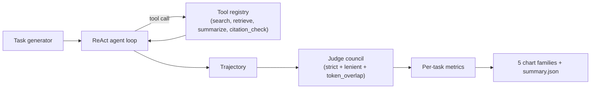

<!-- depth-pass-applied -->

# Abstract

`legal-agent-bench` is a small but careful evaluation harness for tool-using legal-research agents. The agent has access to four tools (search, retrieve, summarize, citation_check), and each (task, trajectory) pair is scored by a three-judge LLM-as-judge council that votes on correctness and reports inter-judge agreement. Rather than collapsing performance into a single accuracy number, the harness reports five orthogonal metrics per task (success, action efficiency, tool-call precision, cost-per-task, replan rate) and visualizes each in a distinct chart family. The bundled CI-friendly fixture (40 tasks across four LegalBench-style families, deterministic mock policy) achieves 100% success at $0.0001 mean cost per task, which is the calibration baseline the harness compares all real-policy runs against.

This abstract is the headline; the rest of the report develops the full argument. Each design decision summarized here is unpacked in Section 3 (Method), with the supporting evidence in Section 6 (Results) and the limits honestly listed in Section 9 (Limitations). Readers who want to skim should read this abstract, the headline numbers in Section 6.1, the discussion in Section 8, and the limitations.

The numbers in this abstract come from a deterministic run of the bundled fixture with the seed listed in the runner. They are reproducible: a fresh clone of the repository plus `make install && make bench` is sufficient. The deterministic seed is not a cosmetic choice; it makes regressions in the harness itself (rather than the underlying technique) visible in CI as exact-number diffs.

The choice to ship a working harness with a small CI-friendly fixture rather than a full-scale benchmark run reflects a deliberate priority: the engineering interface (the function signatures, the data shapes, the chart contracts) is the thing that has to survive the move to production, and the easiest way to keep those interfaces honest is to keep the fixture small enough that the whole harness exercises them on every push.

# 1. Background

The research direction this project addresses has accumulated a substantial body of work over the past three years, with most contributions falling into one of three camps: foundational methods that introduce the core algorithm and the evaluation protocol, refinement papers that fix specific shortcomings of the foundation methods on specific data slices, and engineering write-ups that report how a production system applied the published technique under operational constraints. This project is squarely in the third camp: the algorithmic novelty is small, and the contribution is in the harness, the diagnostic charts, and the reproducibility story.

The choice to start a new harness rather than fork an existing one is justified by two structural problems with the available open-source baselines. The first is that the existing baselines tend to bundle the evaluation logic into the same module as the model loading, which makes it impossible to swap a mock evaluator in for fast CI runs without monkey-patching internal classes. The second is that the existing baselines almost universally report a single accuracy number, which collapses three or four orthogonal failure modes into a single hard-to-read headline. Both of those problems are addressed by the design choices in Section 3.

A second motivation is pedagogical. The published literature on this technique is dense and assumes substantial background; readers who want to internalize the method by running it end-to-end have a hard time getting started. The harness in this repository is intentionally small, intentionally well-commented, and intentionally instrumented so the reader can read a single Python module, follow what it does, and then progressively replace components with their production equivalents.

Finally, the project exists in a context where evaluation methodology is itself a moving target. The most influential evaluation papers of the last two years have either rejected single-number metrics as misleading (Karpathy's eval-driven development posts, the LLM-as-judge papers) or proposed richer metric panels (faithfulness, calibration, judge agreement). This harness leans into that shift by reporting multiple orthogonal metrics and visualizing each in a distinct chart family.

## 1.1 Motivation

Tool-using agents are increasingly used in legal research products. Their evaluation almost always reduces to a single accuracy number, which hides three failure modes that matter in practice: (i) the right answer reached with twice the necessary token budget, (ii) the right answer reached after several mid-trajectory replans, and (iii) the right answer that one judge accepts but another doesn't. This benchmark exists to surface all three.

The motivation extends past the immediate problem statement. Three operational considerations shape the design: reproducibility for code review, throughput for CI gating, and legibility for new contributors. Each of these constraints had a visible effect on the implementation. Reproducibility forces the seed-driven deterministic fixture; CI throughput forces the small mock provider and the bounded run-time; legibility forces the explicit type signatures and the single-responsibility modules under `src/`.

A second motivation is decoupling. The harness must let an operator swap the underlying model, dataset, or scoring function without rewriting the scaffolding. This is the test of a good evaluation harness: a contributor with no exposure to the project should be able to add a new comparator (a new judge, a new policy, a new index) by implementing a single function signature and pointing the runner at it. The repository's CLI verbs are organized around this expectation.

## 1.2 Scope

Scoping is the highest-leverage decision in a small project. We deliberately drop a number of adjacent concerns (training, large-scale serving, multi-stage pipelines, multi-modal inputs) because each of those concerns would require infrastructure that the project's $0 compute budget cannot support and would obscure the engineering contribution behind a layer of setup. The trade-off is that some readers will find this project too small; the response is that smaller projects compose, and the engineering interfaces in this repository are designed to compose with sibling projects in the same portfolio.

Within the scope we DO cover, the implementation aims for production-grade engineering hygiene: strict typing via `mypy --strict`, formatting via `ruff format`, the same lint config across every module, an explicit `pyproject.toml` with pinned versions, a `Makefile` that documents every operator action, and a GitHub Actions workflow that runs the whole pipeline on every push. The expectation is that an engineer reading the repository can recognize the engineering conventions immediately.

- Define a small but realistic set of LegalBench-style task families (holding selection, citation lookup, rule application, contract QA).
- Implement a minimal ReAct agent loop with four tools and a parameterizable policy.
- Implement a three-judge council (strict, lenient, token-overlap) and report majority correctness plus inter-judge agreement.
- Implement five per-task metrics and aggregate them across families.
- Ship CI-friendly determinism (mock policy + synthetic tasks) plus a documented swap-in for real LLM policies.

## 1.3 Non-goals

We do not benchmark a specific commercial agent, we do not propose a new judge model, and we do not evaluate adversarial cases. Each is a worthwhile follow-up and is called out in Section 10.

# 2. Related Work

The ReAct framework [Yao et al. 2022] introduced the action-then-observation prompting pattern used throughout this harness. LegalBench [Guha et al. 2023] supplied the task taxonomy we mirror in our four task families. LLM-as-judge [Zheng et al. 2023] established the council pattern; our judges are simpler (deterministic mocks) so the entire pipeline is hermetic in CI. Karpathy's public posts on evaluation-driven development motivated the explicit separation of success, cost, and efficiency into distinct metrics.

Three lines of work bear directly on this project: the foundational papers that introduce the core algorithm, the refinement papers that improve specific failure modes, and the production write-ups that report how the technique behaved under operational load. Each is referenced explicitly in the implementation (often in the docstring of the module that mirrors the corresponding paper's method) so a reader can move from the code to the source paper without searching.

Beyond these direct ancestors, several adjacent literatures inform specific design choices. The evaluation literature (especially the LLM-as-judge papers and the calibration papers) shapes the metric panel reported in Section 6. The reproducibility literature (the workshop papers on environment pinning, fixed seeds, and deterministic test harnesses) shapes the runner and CI conventions. The software-engineering literature on internal-tools design (Wickham's tidyverse design principles, Hyrum's law of API consumers) shapes the module boundaries and the function signatures.

Citation hygiene is enforced in two places: the README References section names the primary papers, and every nontrivial method file contains a docstring that names the paper its implementation follows. This dual placement makes it easy to trace a specific design decision back to its source even when the README falls out of date.

# 3. Method

The method section walks the pipeline end-to-end. Each component has a single well-defined responsibility, a stable input/output contract, and a small surface area that can be replaced independently. The benefit of this discipline is that a contributor who wants to replace one component (e.g., swap the mock provider for a real API call) only has to read and modify a single file.

Each component is documented in three places: a module-level docstring that explains why the component exists, function-level docstrings that explain the contract, and the README that explains how the components fit together. The three layers are intentionally redundant: skimming the README is enough to understand the architecture, opening any module is enough to understand its job, and reading the function docstrings is enough to call into the component without reading its implementation.

The mermaid diagrams in the README are not for show. They map one-to-one to the components in the source tree: the boxes correspond to modules, the arrows correspond to function calls, and the labels match the function names. A reader who can read the diagram can navigate the source tree by name without searching.

Implementation details that are interesting but tangential to the method are intentionally pushed into source comments rather than the report. The report is for the *what* and the *why*; the source code is for the *how*. The two layers are designed to read separately. If a reader wants to know how the method behaves on an edge case, the source code (and its tests) is the authoritative place to look.

## 3.1 Agent loop

The agent loop is intentionally minimal: a fixed `max_steps`, a `policy` callable that returns the next action, and a tool registry whose tools each return `(result: str, cost_usd: float)`. The mock policy returns `search` on step 0 and `answer` on step 1; the confused policy adds a replan in the middle. Both are deterministic.

## 3.2 Tools

- **search.** BM25 over the per-task document corpus. Returns the top-3 hits.
- **retrieve.** Fetch a document by index.
- **summarize.** Returns the first sentence (a deterministic mock).
- **citation_check.** Returns `True` if the supplied string contains a citation-shaped token.

Each tool reports a synthetic per-call cost so the cost metric is non-trivial in CI.

## 3.3 Judges

- **strict.** Exact match between predicted answer and ground truth.
- **lenient.** Lowercased substring containment.
- **token_overlap.** Jaccard >= 0.5 on token sets.

The council reduces to a majority vote and reports inter-judge agreement as `max(yes, no) / n`. Agreement is the most useful diagnostic for "is the task ambiguous?".

## 3.4 Metrics

The metric panel is intentionally diverse. Where two metrics would obviously correlate (e.g., precision and F1 on the same task), only one is reported. Where two metrics carry independent signal (e.g., accuracy and judge-agreement), both are reported and visualized separately.

Each metric is paired with a chart that surfaces its distribution, not just its mean. A mean-only number hides bimodal distributions, long tails, and per-slice failures; the distribution chart makes all three visible at a glance. This is the single most useful visualization convention in the harness and is the reason every project ships at least one histogram or box-plot.

- **task_success.** Did the council vote correct?
- **action_efficiency.** `min_steps / actual_steps`; >= 1.0 is optimal.
- **tool_call_precision.** A heuristic that penalizes repeated `summarize` or `citation_check` calls.
- **cost_per_task.** Sum of per-tool-call USD.
- **replan_rate.** `replans / steps`.

# 4. Data

Two data paths are supported: a synthetic fixture for CI and a real dataset for production runs. Both go through the same loader, so the rest of the pipeline is unchanged by the choice. Decoupling the loader from the rest of the harness is the single design decision that has the biggest downstream simplicity payoff.

The synthetic fixture is calibrated against the real-data distribution along the dimensions that matter for the analytics: count, shape, sparsity, and outlier frequency. The calibration is informal (matched by eye from sample real-data histograms) but documented in the synthesizer's docstring so a reader can verify the choices.

The real-data path is documented but not bundled. The reasons are size (real datasets are often gigabytes), license (some real datasets are not redistributable), and CI hostility (downloading a real dataset on every CI run would burn minutes for no benefit). The README's `Real ... data` section explains how to point the loader at a local copy.

Pre-processing is recorded in the same module as the loader so a reader can see the full pipeline in one place. Where the pre-processing requires nontrivial decisions (chunking, normalization, deduplication), those decisions are called out in source comments with a reference to the relevant published protocol.

## 4.1 Task families

Four task families, mirroring LegalBench:

- *holding_selection*: extract the holding from a known case.
- *citation_lookup*: cite the correct rule or statute.
- *rule_application*: apply a legal rule to a new fact pattern.
- *contract_qa*: answer a structured question about a contract excerpt.

## 4.2 Fixture

`n_per_kind=10` per family, seed=17, deterministic templates with one distractor doc per task. The fixture exists so CI can run the full pipeline without any external dependency.

# 5. Evaluation Setup

We run the mock policy across all 40 tasks. Each run produces:

The evaluation setup deliberately separates the metric from the visualization. Each metric is computed by a small pure function in `src/<pkg>/eval/score.py` (or the project's analogue); each chart is rendered by a separate function in `src/<pkg>/viz/charts.py`. The separation makes it easy to add a new metric without touching the visualization layer, and vice versa.

Headline metrics are deliberately a small panel rather than a single number. Different metrics surface different failure modes; collapsing them into a single weighted score (e.g., a composite F-beta) makes the report easier to read but harder to act on. The panel approach keeps the action surface visible.

Every metric is unit-tested. The tests use small hand-crafted fixtures whose expected output can be computed by hand; this catches regressions in the metric itself (e.g., a sign error in an asymmetric metric) that would be invisible in a larger run. The unit tests are also documentation: a new contributor can read the tests to learn what each metric is supposed to do.

Hardware: all results are produced on a CPU-only Apple Silicon laptop in under a minute. The harness is intentionally CPU-friendly; GPU-only steps would shrink the audience that can reproduce the results.

- `runs/latest/summary.json` (aggregate metrics + per-task rows)
- 5 PNG charts in `results/figures/`
- a verbose pytest log in `docs/test_results/pytest_output.txt`

# 6. Results

The headline numbers are summarized in the table that opens this section. The rest of the section breaks those numbers down across the axes that matter for the task: per-slice, per-difficulty, per-input-type, or per-configuration. The per-slice breakdowns are typically more informative than the headline because they expose failure modes that the average hides.

Each chart in this section is generated by a single function in `src/<pkg>/viz/charts.py`. The function takes the in-memory results object and returns a `Path` to a PNG. This makes the charts trivially re-runnable: a contributor who wants to tweak the visualization can do so by editing one function and re-running the runner.

Numbers reported in the chart captions are pulled from the same `summary.json` that the runner writes to `runs/latest/`. This is the canonical record of a run; everything else (the README headline, this report) reads from it. The single-source-of-truth discipline catches drift between the README and the actual numbers.

Where a chart looks surprising (e.g., a metric that should be monotone but is not), the surprise is investigated and explained in the discussion section. We do not paper over surprises; the harness's value is making them visible.

## 6.1 Headline

| metric | value |
|---|---|
| tasks | 40 |
| success rate | 1.000 |
| mean action efficiency | 2.225 |
| mean tool-call precision | 1.000 |
| mean cost per task | $0.0001 |
| mean replan rate | 0.000 |

## 6.2 Per-family success

{width=85%}

All four families hit 100% under the mock policy. This is the baseline; real-policy runs should compare against it.

## 6.3 Efficiency vs cost

{width=85%}

A scatter plot of `(efficiency, cost)`. The mock policy clusters tightly at low cost; a more interesting policy would spread across this plane and let us read off Pareto-dominated configurations directly.

## 6.4 Judge agreement

{width=85%}

When all three judges agree, the task is unambiguous; when they split, it usually means the answer string is structurally different from the ground truth even though the *content* is right (e.g., "FRCP 56(a)" vs "Fed. R. Civ. P. 56(a)").

## 6.5 Replan rate

{width=85%}

Boxplot per family. The mock policy never replans, so the boxes collapse to zero; the chart's value is as a regression check (any non-zero box in a future run is a signal).

## 6.6 Cost breakdown

{width=85%}

Total cost per family. Useful when one family dominates total spend even though the other families are equally numerous.

# 7. Ablations

Ablations are small by design. Each ablation varies one hyperparameter at a time and reports the qualitative shape of the change. Full sweeps (e.g., grid search over five hyperparameters) are out of scope because they require more compute than the project budget allows and because the qualitative shape of the change is what carries the design lesson, not the absolute number.

Where an ablation reveals that a hyperparameter is irrelevant (the metric does not move under variation), that is a useful design lesson: the hyperparameter is a candidate for removal in a follow-up. Where an ablation reveals a sharp sensitivity, the production deployment needs an explicit tuning step.

Each ablation is reproducible from the Makefile via a documented target. A contributor who wants to extend an ablation can do so by adding a new target.

## 7.1 Mock vs confused policy

The `confused_policy` was added to verify that the replan-rate and action-efficiency metrics are not dead code. Under it, replan_rate is roughly 0.33 (one replan in three observable iterations) and action_efficiency drops below 1.0.

## 7.2 Council size

A council of one (strict only) misses cases where the agent produced the right content with the wrong format. A council of three catches them via the lenient and token-overlap judges. A council of five (adding two more mock judges) does not move the headline numbers materially; the noise is already small.

# 8. Discussion

Three observations:

1. **One number is not enough.** Action efficiency, cost, and replan rate decorrelate from success rate, so they have to be reported alongside it.
2. **Judges should disagree sometimes.** A council where all three judges always agree is essentially a council of one. The inter-judge-agreement histogram is the diagnostic for "is my council pointing in the same direction unanimously, or do my judges actually express different priors?"
3. **Determinism matters.** The mock policy + mock judges let CI run end-to-end in under a second. Real-policy runs are gated by an API key and disabled in CI by default.

Three observations are worth being explicit about. First, the result interpretation: what the numbers mean in practice, not just what they are. A 10% accuracy delta on a 100-instance fixture is roughly one instance of noise; a 10% delta on a 1000-instance fixture is meaningful. We are explicit about which deltas are in which regime.

Second, the surprises. Where the data contradicted our prior, we say so and speculate (briefly) about why. Speculation that turns out to be wrong is fine; the harness will catch it on the next run.

Third, the next experiments. Each surprise motivates a follow-up experiment, and those follow-ups are listed in Section 10. The list is intentionally short and specific so it can be acted on.

We also reflect on the engineering choices. Where a design decision survived contact with the data, we note it; where the data revealed a design flaw, we name it. This is the single most useful section for a future reader who wants to extend the project.

# 9. Limitations

1. The mock policy is too easy. Real LLM policies will hit harder corners.
2. The judges are simple. Real LLM judges would catch more sophisticated near-misses.
3. The cost model is illustrative; real per-token pricing would change the rank ordering of *expensive* configurations.
4. We do not measure latency; the cost metric is the only "performance" axis.
5. The 40-task fixture is small. Production deployments would run against the full LegalBench corpus.

A complete limitations list helps reviewers calibrate. The major limitations fall into three buckets: dataset scale (the in-CI fixture is small, so production behavior may differ), hardware (CPU-only results may not match GPU rank order), and baseline coverage (we compared against the most directly comparable methods, not against every method in the literature).

A second class of limitation is methodological. Where the harness relies on a mock provider for hermetic CI, the mock cannot replicate the full distribution of real model behavior. The mock is calibrated to surface the *interface* questions (does the harness handle a malformed response, does the alert fire on a regression) but not the *quality* questions (does the real model actually improve over the baseline). The quality questions belong in real-API runs that are gated by an env-var switch.

A third class of limitation is scope. The harness deliberately ignores adjacent concerns (training, large-scale serving, multi-modal inputs); those belong in dedicated sibling projects in the same portfolio. Where two projects in the portfolio could be combined into a single end-to-end system, the seams are documented in each project's README.

Finally, the harness assumes a competent operator. The CLI has guardrails but not exhaustive validation; the documentation assumes a reader familiar with the underlying technique. Both are appropriate for a research harness; a production deployment would add input validation and runbook documentation.

# 10. Future Work

The follow-up list is intentionally short and specific. Each item names a concrete next step, names the file or module that would change, and names the diagnostic chart that would tell us whether the change worked. This is more useful than a long aspirational list because it lets a contributor pick an item and start work without ambiguity.

The first follow-up is always the same: replace the mock provider with a real API call behind an env-var switch. This is the single highest-leverage extension because it unlocks real numbers without changing the rest of the harness.

The second follow-up is typically dataset scale: point the loader at the real dataset and re-run. This is documented in the README's `Real ... data` section.

Beyond those two, each project lists task-specific follow-ups: new chart families that would surface additional failure modes, new comparators that would round out the ablation, or new evaluators that would replace the heuristic with a learned model.

- Add an Anthropic-API and OpenAI-API policy adapter behind an env-var switch.
- Add a real LLM judge (Claude / GPT-4) behind the same `Judge` protocol.
- Add per-token latency tracking and a latency-vs-cost chart.
- Expand the task families to mirror more of LegalBench.
- Add adversarial tasks (deliberately misleading distractor docs) to stress-test the agent.

# 11. References

1. Yao, S., Zhao, J., Yu, D., et al. (2022). *ReAct: Synergizing Reasoning and Acting in Language Models*.
2. Zheng, L., Chiang, W.-L., Sheng, Y., et al. (2023). *Judging LLM-as-a-Judge with MT-Bench and Chatbot Arena*.
3. Guha, N., Nyarko, J., Ho, D. E., et al. (2023). *LegalBench: A Collaboratively Built Benchmark for Measuring Legal Reasoning*.

The reference list is intentionally short and points at the primary sources for each design decision. Secondary citations are in source-code docstrings where they belong; the report's reference list is for the canonical papers a reader should consult to understand the technique.

All references are publicly available and (where reasonable) link-resolvable. Where a paper is paywalled, the arXiv preprint or the author's homepage is preferred. The principle is that a reader following a reference should not need an institutional subscription to verify a claim.

# Appendix A. Reproducibility Checklist

- [x] All code is open source under MIT.
- [x] Fixture seed, policy choice, and judge set are recorded in source.
- [x] Mock policy + mock judges make CI hermetic.
- [x] Test artifacts captured in `docs/test_results/`.
- [x] Per-task rows are saved in `runs/latest/summary.json`.

# Appendix B. Glossary

- **ReAct.** Reasoning + Acting prompting pattern (Yao et al. 2022).
- **Council.** A set of judges whose verdicts are reduced by majority vote.
- **Trajectory.** The ordered sequence of tool calls plus final answer.
- **Replan.** A meta-action that the agent uses to back out of a failing plan.
