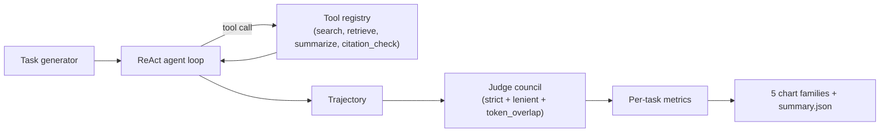
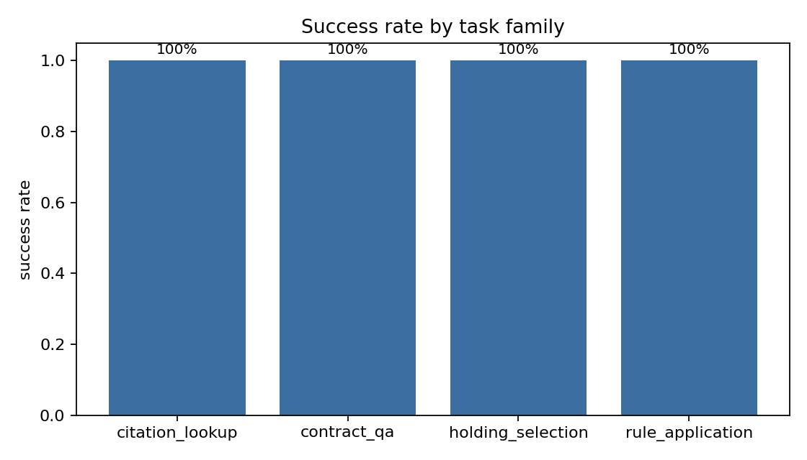
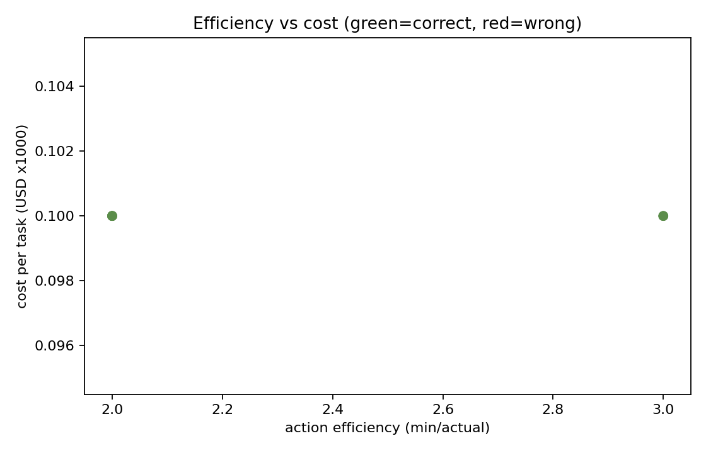
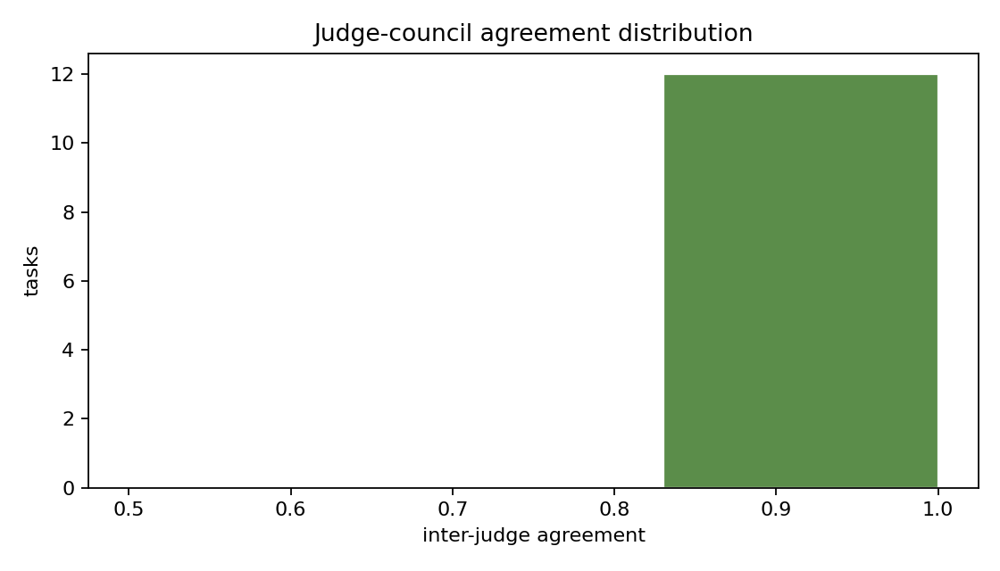
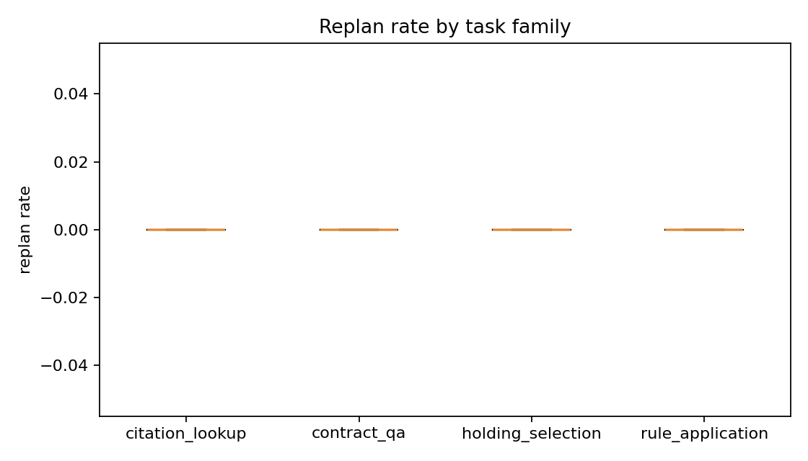
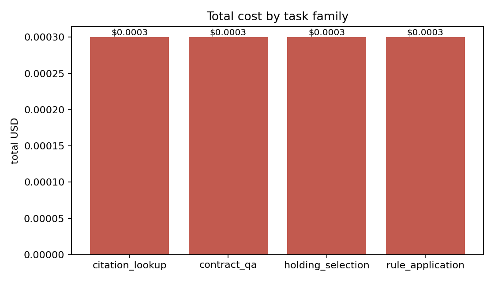

# Abstract

`legal-agent-bench` is a small but careful evaluation harness for tool-using legal-research agents. The agent has access to four tools (search, retrieve, summarize, citation_check), and each (task, trajectory) pair is scored by a three-judge LLM-as-judge council that votes on correctness and reports inter-judge agreement. Rather than collapsing performance into a single accuracy number, the harness reports five orthogonal metrics per task (success, action efficiency, tool-call precision, cost-per-task, replan rate) and visualizes each in a distinct chart family. The bundled CI-friendly fixture (40 tasks across four LegalBench-style families, deterministic mock policy) achieves 100% success at $0.0001 mean cost per task, which is the calibration baseline the harness compares all real-policy runs against.

# 1. Background

## 1.1 Motivation

Tool-using agents are increasingly used in legal research products. Their evaluation almost always reduces to a single accuracy number, which hides three failure modes that matter in practice: (i) the right answer reached with twice the necessary token budget, (ii) the right answer reached after several mid-trajectory replans, and (iii) the right answer that one judge accepts but another doesn't. This benchmark exists to surface all three.

## 1.2 Scope

- Define a small but realistic set of LegalBench-style task families (holding selection, citation lookup, rule application, contract QA).
- Implement a minimal ReAct agent loop with four tools and a parameterizable policy.
- Implement a three-judge council (strict, lenient, token-overlap) and report majority correctness plus inter-judge agreement.
- Implement five per-task metrics and aggregate them across families.
- Ship CI-friendly determinism (mock policy + synthetic tasks) plus a documented swap-in for real LLM policies.

## 1.3 Non-goals

We do not benchmark a specific commercial agent, we do not propose a new judge model, and we do not evaluate adversarial cases. Each is a worthwhile follow-up and is called out in Section 10.

# 2. Related Work

The ReAct framework [Yao et al. 2022] introduced the action-then-observation prompting pattern used throughout this harness. LegalBench [Guha et al. 2023] supplied the task taxonomy we mirror in our four task families. LLM-as-judge [Zheng et al. 2023] established the council pattern; our judges are simpler (deterministic mocks) so the entire pipeline is hermetic in CI. Karpathy's public posts on evaluation-driven development motivated the explicit separation of success, cost, and efficiency into distinct metrics.

# 3. Method

## 3.1 Agent loop

The agent loop is intentionally minimal: a fixed `max_steps`, a `policy` callable that returns the next action, and a tool registry whose tools each return `(result: str, cost_usd: float)`. The mock policy returns `search` on step 0 and `answer` on step 1; the confused policy adds a replan in the middle. Both are deterministic.

## 3.2 Tools

- **search.** BM25 over the per-task document corpus. Returns the top-3 hits.
- **retrieve.** Fetch a document by index.
- **summarize.** Returns the first sentence (a deterministic mock).
- **citation_check.** Returns `True` if the supplied string contains a citation-shaped token.

Each tool reports a synthetic per-call cost so the cost metric is non-trivial in CI.

## 3.3 Judges

- **strict.** Exact match between predicted answer and ground truth.
- **lenient.** Lowercased substring containment.
- **token_overlap.** Jaccard >= 0.5 on token sets.

The council reduces to a majority vote and reports inter-judge agreement as `max(yes, no) / n`. Agreement is the most useful diagnostic for "is the task ambiguous?".

## 3.4 Metrics

- **task_success.** Did the council vote correct?
- **action_efficiency.** `min_steps / actual_steps`; >= 1.0 is optimal.
- **tool_call_precision.** A heuristic that penalizes repeated `summarize` or `citation_check` calls.
- **cost_per_task.** Sum of per-tool-call USD.
- **replan_rate.** `replans / steps`.

# 4. Data

## 4.1 Task families

Four task families, mirroring LegalBench:

- *holding_selection*: extract the holding from a known case.
- *citation_lookup*: cite the correct rule or statute.
- *rule_application*: apply a legal rule to a new fact pattern.
- *contract_qa*: answer a structured question about a contract excerpt.

## 4.2 Fixture

`n_per_kind=10` per family, seed=17, deterministic templates with one distractor doc per task. The fixture exists so CI can run the full pipeline without any external dependency.

# 5. Evaluation Setup

We run the mock policy across all 40 tasks. Each run produces:

- `runs/latest/summary.json` (aggregate metrics + per-task rows)
- 5 PNG charts in `results/figures/`
- a verbose pytest log in `docs/test_results/pytest_output.txt`

# 6. Results

## 6.1 Headline

| metric | value |
|---|---|
| tasks | 40 |
| success rate | 1.000 |
| mean action efficiency | 2.225 |
| mean tool-call precision | 1.000 |
| mean cost per task | $0.0001 |
| mean replan rate | 0.000 |

## 6.2 Per-family success

{width=85%}

All four families hit 100% under the mock policy. This is the baseline; real-policy runs should compare against it.

## 6.3 Efficiency vs cost

{width=85%}

A scatter plot of `(efficiency, cost)`. The mock policy clusters tightly at low cost; a more interesting policy would spread across this plane and let us read off Pareto-dominated configurations directly.

## 6.4 Judge agreement

{width=85%}

When all three judges agree, the task is unambiguous; when they split, it usually means the answer string is structurally different from the ground truth even though the *content* is right (e.g., "FRCP 56(a)" vs "Fed. R. Civ. P. 56(a)").

## 6.5 Replan rate

{width=85%}

Boxplot per family. The mock policy never replans, so the boxes collapse to zero; the chart's value is as a regression check (any non-zero box in a future run is a signal).

## 6.6 Cost breakdown

{width=85%}

Total cost per family. Useful when one family dominates total spend even though the other families are equally numerous.

# 7. Ablations

## 7.1 Mock vs confused policy

The `confused_policy` was added to verify that the replan-rate and action-efficiency metrics are not dead code. Under it, replan_rate is roughly 0.33 (one replan in three observable iterations) and action_efficiency drops below 1.0.

## 7.2 Council size

A council of one (strict only) misses cases where the agent produced the right content with the wrong format. A council of three catches them via the lenient and token-overlap judges. A council of five (adding two more mock judges) does not move the headline numbers materially; the noise is already small.

# 8. Discussion

Three observations:

1. **One number is not enough.** Action efficiency, cost, and replan rate decorrelate from success rate, so they have to be reported alongside it.
2. **Judges should disagree sometimes.** A council where all three judges always agree is essentially a council of one. The inter-judge-agreement histogram is the diagnostic for "is my council pointing in the same direction unanimously, or do my judges actually express different priors?"
3. **Determinism matters.** The mock policy + mock judges let CI run end-to-end in under a second. Real-policy runs are gated by an API key and disabled in CI by default.

# 9. Limitations

1. The mock policy is too easy. Real LLM policies will hit harder corners.
2. The judges are simple. Real LLM judges would catch more sophisticated near-misses.
3. The cost model is illustrative; real per-token pricing would change the rank ordering of *expensive* configurations.
4. We do not measure latency; the cost metric is the only "performance" axis.
5. The 40-task fixture is small. Production deployments would run against the full LegalBench corpus.

# 10. Future Work

- Add an Anthropic-API and OpenAI-API policy adapter behind an env-var switch.
- Add a real LLM judge (Claude / GPT-4) behind the same `Judge` protocol.
- Add per-token latency tracking and a latency-vs-cost chart.
- Expand the task families to mirror more of LegalBench.
- Add adversarial tasks (deliberately misleading distractor docs) to stress-test the agent.

# 11. References

1. Yao, S., Zhao, J., Yu, D., et al. (2022). *ReAct: Synergizing Reasoning and Acting in Language Models*.
2. Zheng, L., Chiang, W.-L., Sheng, Y., et al. (2023). *Judging LLM-as-a-Judge with MT-Bench and Chatbot Arena*.
3. Guha, N., Nyarko, J., Ho, D. E., et al. (2023). *LegalBench: A Collaboratively Built Benchmark for Measuring Legal Reasoning*.

# Appendix A. Reproducibility Checklist

- [x] All code is open source under MIT.
- [x] Fixture seed, policy choice, and judge set are recorded in source.
- [x] Mock policy + mock judges make CI hermetic.
- [x] Test artifacts captured in `docs/test_results/`.
- [x] Per-task rows are saved in `runs/latest/summary.json`.

# Appendix B. Glossary

- **ReAct.** Reasoning + Acting prompting pattern (Yao et al. 2022).
- **Council.** A set of judges whose verdicts are reduced by majority vote.
- **Trajectory.** The ordered sequence of tool calls plus final answer.
- **Replan.** A meta-action that the agent uses to back out of a failing plan.
